# Ablauf der Skills und Agenten

Der Hauptagent koordiniert die Skills und prüft die Ergebnisse. Die drei spezialisierten Agenten übernehmen Recherche, Erfassung und Bewertung.

```mermaid
flowchart TD
    subgraph A["Phase A · /thema-anlegen"]
        A1["Thema prüfen<br/>Wahlprogramm-Zugriffe sperren"]
        A2["Agent: ursachen-recherche<br/>Unabhängige Quellen, Ziel, Ursachen, Perspektiven"]
        A3["Hauptagent prüft Vorschlag<br/>und liest fehlende Quellen nach"]
        A4["Themendatei und Dokumentation<br/>Seed, Datenprüfung, Tests"]
        A5["Pull Request nur mit Ursachen<br/>STOPP"]
        A1 --> A2 --> A3 --> A4 --> A5
        A3 -->|"Rückfragen"| A2
    end

    F["Betreiberin prüft Originalquellen und Ebenen<br/>trägt Freigabe ein und mergt"]
    A5 --> F
    F -.->|"Danach separat aufrufen"| B0

    subgraph B["Phase B · /thema-erfassen"]
        B0{"Ursachen freigegeben<br/>und unverändert?"}
        STOP["Abbruch"]
        B1["Programme auswählen und Texte bereitstellen<br/>Gleiche Suchbegriffe je Lösungsrichtung"]
        B2["Agent: programm-erfassung<br/>Je Programm ein Auftrag, bis zu 7 parallel"]
        B3["Maßnahmen mit Zitaten und PDF-Seiten<br/>Antworten unverändert protokollieren"]
        B4["Hauptagent prüft Plausibilität<br/>Synonyme vereinheitlichen, Treffermatrix prüfen"]
        B0 -->|"Nein"| STOP
        B0 -->|"Ja"| B1 --> B2 --> B3 --> B4
        B4 -->|"Unklarheiten oder auffällige Treffer"| B2
    end

    subgraph C["Phase C · Blindbewertung"]
        C1["entwurf:blind<br/>Herkunft anonymisieren, Kennungen und Prüfsumme<br/>Erfassung einfrieren"]
        C2["Agent: blind-bewertung<br/>Nur Blindliste und Datum<br/>Forschungsstand, Instrumente, Bewertung"]
        C3["Bewertung automatisch prüfen<br/>Hauptagent prüft Methode, nicht Ergebnis"]
        B4 --> C1 --> C2 --> C3
        C3 -->|"Bewertungsrückfragen, weiterhin blind"| C2
        C3 -->|"Erfassung muss korrigiert werden"| B2
    end

    subgraph D["Phase D · Eintragen und Übergabe"]
        D1["Eintragen als ungeprüfter KI-Entwurf<br/>IDs und Beleg-Links erzeugen"]
        D2["Daten, Zitate, Punkte, Seed und Tests prüfen"]
        D3["Dokumentation und Pull Request<br/>Protokolle und offene Fragen ausweisen"]
        C3 -->|"Prüfung bestanden"| D1 --> D2 --> D3
    end

    D3 --> H["Menschliche Bewertung durch eingeladene Prüfende<br/>Belegprüfung durch Betreiberin"]
```

## Informationsgrenzen

| Rolle | Darf sehen / tun | Darf nicht |
|---|---|---|
| `ursachen-recherche` | Unabhängige Quellen recherchieren | Wahlprogramme oder Parteiquellen lesen |
| `programm-erfassung` | Das zugewiesene Programm lesen, Maßnahmen belegen | Maßnahmen bewerten |
| `blind-bewertung` | Anonymisierte Maßnahmen und Forschung bewerten | Herkunft suchen oder Repository lesen |
| Hauptagent bei `/thema-erfassen` | Aufträge, Protokolle und Prüfungen koordinieren | Programme selbst lesen oder Werte vergeben |

## Wichtige Regeln

- Phase A endet mit dem Pull Request. Die Erfassung startet erst nach menschlicher Freigabe und Merge durch einen separaten Aufruf von `/thema-erfassen`.
- Nicht durchsuchte Programme bleiben „noch nicht erfasst“, nicht „keine Maßnahme“. Fehlende Daten dürfen keiner Partei einen Punkt kosten.
- Alle Programme erhalten dieselben Suchbegriffe je Ursache und Lösungsrichtung. Zusätzliche Synonyme werden für alle Programme berücksichtigt.
- Aufträge, Antworten und Rückfragen werden protokolliert.
- Änderungen an der eingefrorenen Erfassung erfordern eine neue Blindliste und Bewertung.
- Die Bewertungen sind KI-Entwürfe. Die Punkte im Spiel kommen deterministisch aus dem Datenkatalog, nicht aus einer Bewertung durch die Gesprächs-KI.

## Grundlage

- Skill [thema-anlegen/SKILL.md](thema-anlegen/SKILL.md)
- Skill [thema-erfassen/SKILL.md](thema-erfassen/SKILL.md)
- Agent [../agents/ursachen-recherche.md](../agents/ursachen-recherche.md)
- Agent [../agents/programm-erfassung.md](../agents/programm-erfassung.md)
- Agent [../agents/blind-bewertung.md](../agents/blind-bewertung.md)