# Ablauf der Skills und Agenten

Der Hauptagent koordiniert die Skills und prüft die Ergebnisse. Die drei spezialisierten Agenten übernehmen Recherche, Erfassung und Bewertung.

```mermaid
flowchart TD
    subgraph A["Phase A · /thema-anlegen"]
        A1["Thema prüfen<br/>Wahlprogramm-Zugriffe sperren"]
        A2["Agent: ursachen-recherche<br/>Unabhängige Quellen, Ziel, Ursachen, Perspektiven"]
        A3["Hauptagent prüft Vorschlag<br/>und liest fehlende Quellen nach"]
        A4["Themendatei, Leitfaden und Dokumentation<br/>Seed, Datenprüfung, Tests"]
        A5["Pull Request nur mit Ursachen<br/>STOPP"]
        A1 --> A2 --> A3 --> A4 --> A5
        A3 -->|"Rückfragen"| A2
    end

    F["Betreiberin prüft Originalquellen, Ebenen und Leitfaden<br/>trägt Freigabe ein und mergt"]
    A5 --> F
    F -.->|"Danach separat aufrufen"| B0

    subgraph B["Phase B · /thema-erfassen"]
        B0{"Ursachen freigegeben<br/>und unverändert?"}
        STOP["Abbruch"]
        B1["Leitfaden und Suchbegriffe festlegen<br/>entwurf:treffer --vorab: zu allgemeine Begriffe genauer fassen<br/>entwurf:auftrag: Texte, Treffer, Fundstellen je Programm"]
        B2["Agent: programm-erfassung<br/>Nur der eigene Auftrag, bis zu 7 parallel"]
        B3["Agent prüft sich selbst<br/>entwurf:programm-pruefen: Zitat auf der Seite, Bündel, Ebene<br/>Kurzbericht in fester Form"]
        B4["Koordination: zusammenführen, Treffermatrix<br/>höchstens eine gebündelte Rückfrage je Programm"]
        B5["Vergleich mit dem vorherigen Stand<br/>entfallen, zusammengefasst, Ursache ohne Maßnahme"]
        B0 -->|"Nein"| STOP
        B0 -->|"Ja"| B1 --> B2 --> B3 --> B4
        B3 -->|"Fehler"| B2
        B4 -->|"Unplausibel oder Pflichtursache unbegründet"| B2
        B4 --> B5
        B5 -->|"Verlust durch eigene Rückfrage: Korrektur, protokolliert"| B2
    end

    subgraph C["Phase C · Blindbewertung"]
        C1["entwurf:blind<br/>Herkunft anonymisieren, Regeln des Leitfadens, Prüfsumme<br/>Kennungen über den Inhalt: neu / entfallen / geändert<br/>Erfassung einfrieren"]
        C1a["entwurf:bewertung-auftrag<br/>Auftrag mit zwei Pfaden, Prüfsumme, Datum"]
        C2["Agent: blind-bewertung<br/>liest nur blind.json, schreibt nur bewertung-antwort.txt (Hook)<br/>Forschungsstand, Instrumente, Bewertung<br/>entscheidet die Zuordnung zu Ursachen"]
        C3["entwurf:json und entwurf:bewertung-pruefen<br/>Koordination prüft Methode, nicht Ergebnis"]
        B5 -->|"geprüft"| C1 --> C1a --> C2 --> C3
        C3 -->|"Formfehler: Rückfrage mit Zeile, Spalte, Kennung"| C1a
        C3 -->|"wenige Kennungen neu: Teil-Neubewertung"| C1
    end

    subgraph D["Phase D · Eintragen und Übergabe"]
        D1["Eintragen als ungeprüfter KI-Entwurf<br/>nur bestätigte Ursachen, IDs und Beleg-Links"]
        D2["Daten, Zitate, Punkte, Seed und Tests prüfen"]
        D3["Dokumentation und Pull Request<br/>Protokolle und offene Fragen ausweisen"]
        C3 -->|"Prüfung bestanden"| D1 --> D2 --> D3
    end

    D3 --> H["Menschliche Bewertung durch eingeladene Prüfende<br/>Belegprüfung durch Betreiberin"]
```

## Informationsgrenzen

| Rolle | Darf sehen / tun | Darf nicht |
|---|---|---|
| `ursachen-recherche` | Unabhängige Quellen recherchieren | Wahlprogramme oder Parteiquellen lesen |
| `programm-erfassung` | Den eigenen Auftrag und das zugewiesene Programm lesen, Maßnahmen belegen, Ergebnis selbst schreiben und prüfen | Maßnahmen bewerten, andere Programme oder die Gesamterfassung lesen |
| `blind-bewertung` | `blind.json` lesen, `protokoll/bewertung-antwort.txt` schreiben, unabhängige Quellen recherchieren; Zuordnung zu Ursachen entscheiden | Andere Dateien lesen oder schreiben (Hook), Herkunft suchen |
| Koordination (Hauptagent bei `/thema-erfassen`) | Leitfaden und Suchbegriffe festlegen, Aufträge, Protokolle und Prüfungen koordinieren, eigene fehlerhafte Rückfragen protokolliert korrigieren | Programme selbst lesen, Werte oder Zuordnungen vergeben, Blindliste oder Bewertung abschreiben |

## Wichtige Regeln

- Phase A endet mit dem Pull Request. Die Erfassung startet erst nach menschlicher Freigabe und Merge durch einen separaten Aufruf von `/thema-erfassen`.
- Nicht durchsuchte Programme bleiben „noch nicht erfasst“, nicht „keine Maßnahme“. Fehlende Daten dürfen keiner Partei einen Punkt kosten.
- Alle Programme erhalten dieselben Suchbegriffe je Ursache und Lösungsrichtung und denselben Leitfaden (`daten/leitfaeden/<ID>.json`). Zusätzliche Synonyme und neue Bündel werden für alle Programme berücksichtigt.
- Grenzfälle der Zuordnung markiert die Erfassung als `ursachen_offen`; entschieden wird ohne Parteinamen in der Bewertung. Unbestätigte Ursachen fallen beim Eintragen weg.
- **Bündel** (Erfassung) und **Instrument** (Bewertung) sind verschiedene Dinge: Ein Bündel begrenzt je Programm gleichartige Einzelzusagen auf eine Maßnahme; ein Instrument fasst gleiche Lösungswege für eine gemeinsame Bewertung zusammen. Zwei verschiedene Zusagen werden nie zusammengefasst, nur um die Bündelregel einzuhalten.
- Was Skripte können (zählen, Fundstellen, Zitatprüfung, Vergleich nach Rückfragen), machen Skripte. Höchstens eine gebündelte Rückfrage je Programm; Korrekturen eigener Fehler sind erlaubt und stehen im Protokoll und im Pull Request.
- Kennungen der Blindliste bleiben stabil (Zuordnung über Partei, Land und Zitat). Neue Maßnahmen bekommen neue Kennungen, entfallene werden nicht neu vergeben.
- Erfassungs-Agenten laufen mit der nächstkleineren Modellstufe des Koordinators (wenn wählbar, nie automatisch die kleinste), alle Programme eines Durchlaufs mit demselben Modell; die Bewertung mit dem Modell des Koordinators.
- Aufträge, Antworten und Rückfragen werden protokolliert. Die Agenten schreiben ihre Antworten selbst; niemand schreibt Blindliste oder Bewertung ab.
- Änderungen an der eingefrorenen Erfassung erfordern eine neue Blindliste und Bewertung.
- Die Bewertungen sind KI-Entwürfe. Die Punkte im Spiel kommen deterministisch aus dem Datenkatalog, nicht aus einer Bewertung durch die Gesprächs-KI.

## Grundlage

- Skill [thema-anlegen/SKILL.md](thema-anlegen/SKILL.md)
- Skill [thema-erfassen/SKILL.md](thema-erfassen/SKILL.md) mit Referenzen in [thema-erfassen/reference/](thema-erfassen/reference/) und Evaluationen in [thema-erfassen/evals/](thema-erfassen/evals/)
- Agent [../agents/ursachen-recherche.md](../agents/ursachen-recherche.md)
- Agent [../agents/programm-erfassung.md](../agents/programm-erfassung.md)
- Agent [../agents/blind-bewertung.md](../agents/blind-bewertung.md)