# Datenmodell

Stand: Migrationen bis `20261003000000_pruef_einheiten.sql` (`supabase/migrations/`).
Die kuratierten Daten liegen als JSON in `daten/`; `npm run seed` erzeugt daraus die `seed.sql`.

## ER-Diagramm

```mermaid
erDiagram
    parteien ||--o{ massnahmen : "hat"
    themen ||--o{ massnahmen : "gehört zu"
    themen ||--o{ ursachen : "hat"
    themen ||--o{ abdeckung : "ist erfasst für"
    parteien ||--o{ abdeckung : "ist erfasst für"
    parteien ||--o{ landesprogramme : "hat"
    laender ||--o{ landesprogramme : "gilt in"
    laender |o--o{ massnahmen : "land (null = Bund)"
    laender |o--o{ abdeckung : "land (null = Bund)"
    themen |o--o{ runden : "thema_id"
    parteien |o--o{ runden : "partei_a / partei_b"
    themen ||--o{ pruef_einheiten : "gehört zu"
    pruef_einladungen ||--o{ pruef_bewertungen : "gibt ab"

    parteien {
        smallint id PK
        text name
        text kurzname
        text farbe
        text programm_url
        date programm_stand
    }
    themen {
        smallint id PK
        text name
        text beschreibung
    }
    ursachen {
        smallint id PK
        smallint thema_id FK
        text beschreibung
        text quelle_url
        text ebene "bund | land"
    }
    massnahmen {
        serial id PK
        smallint thema_id FK
        smallint partei_id FK
        text land FK "null = Bundesprogramm"
        text beschreibung
        smallint_arr ursachen_ids "Verweis auf ursachen.id"
        smallint wirksamkeit "0-3"
        smallint umsetzbarkeit "0-3"
        jsonb rollen_modifikator
        text begruendung
        text beleg_programm_url
        text beleg_studie_url
        text evidenz "belegt | gemischt | offen"
        date stand
        boolean geprueft
        boolean ki_entwurf
    }
    abdeckung {
        smallint thema_id FK
        smallint partei_id FK
        text land FK "null = Bund"
        text art "massnahmen | keine"
        text begruendung
        date stand
        boolean ki_entwurf
    }
    laender {
        text id PK "z. B. ST"
        text name
        date letzte_wahl
    }
    landesprogramme {
        smallint partei_id PK
        text land PK
        text url
        date stand
        text kein_programm
    }
    runden {
        bigint id PK
        timestamptz created_at
        smallint thema_id FK
        text problem_text
        smallint partei_a FK
        smallint partei_b FK
        smallint punkte_a
        smallint punkte_b
        text status "gewertet | ungeprueft | unvollstaendig | wert"
        boolean freigegeben
        boolean testphase
    }
    review_warteschlange {
        bigint id PK
        text problem_text
        text einschaetzung
        boolean erledigt
    }
    rate_limit {
        uuid sitzung PK
        timestamptz fenster_start
        int anzahl
    }
    pruef_einladungen {
        uuid id PK
        text token_hash
        text name
        smallint_arr themen
        boolean gesperrt
        timestamptz einwilligung_am
    }
    pruef_bewertungen {
        uuid einladung_id PK
        int massnahme_id PK
        smallint thema_id
        smallint wirksamkeit
        smallint umsetzbarkeit
        boolean abgesendet
    }
    pruef_einheiten {
        int id PK
        smallint thema_id FK
    }
    testphase_zugaenge {
        uuid id PK
        text token_hash
        text name
        boolean gesperrt
    }
    admins {
        uuid user_id PK
    }
```



`massnahmen.ursachen_ids` ist ein Array und daher keine echte Fremdschlüsselbeziehung.
`pruef_bewertungen.massnahme_id` verweist auf IDs aus `daten/`, nicht zwingend auf `massnahmen`.

## Gruppen

| Gruppe | Tabellen | Zugriff |
|---|---|---|
| Stammdaten | `parteien`, `themen`, `laender`, `landesprogramme` | lesbar |
| Kern | `ursachen`, `massnahmen`, `abdeckung` | lesbar; ohne KI-Entwürfe, außer in der Testphase |
| Spieldaten | `runden`, `review_warteschlange`, `rate_limit` | schreibbar nur über Edge Function |
| Betrieb | `admins`, `pruef_*`, `testphase_zugaenge` | anon gesperrt; Admins und Edge Functions |

## Bund oder Land?

- `massnahmen.land IS NULL` → Bundesprogramm; sonst Landtagswahlprogramm dieses Landes.
- `abdeckung.land` gilt genauso.
- `ursachen.ebene` sagt, wer für die Ursache zuständig ist. Das ist etwas anderes als die Herkunft der Maßnahme.

```sql
select id, partei_id,
       case when land is null then 'Bund' else 'Land: ' || land end as ebene,
       beschreibung
from massnahmen
order by land nulls first, partei_id;
```

## Ablauf einer Wertung

1. Die KI ordnet das Problem Thema und Ursachen zu.
2. `abdeckung` prüfen. Fehlt ein Eintrag für eine der Parteien, ist der Status `unvollstaendig` und es gibt keine Punkte.
3. Je Ursache zählt die beste Maßnahme (`wirksamkeit × umsetzbarkeit`, mit Rollen-Modifikator). Bei gewähltem Land zählen die Landesprogramme, sonst der Bund.
4. Die Summe über die Ursachen ergibt die Rundenpunkte. Wer mehr hat, bekommt 1 Punkt, bei Gleichstand beide 1 Punkt. Das Ergebnis steht in `runden`.
